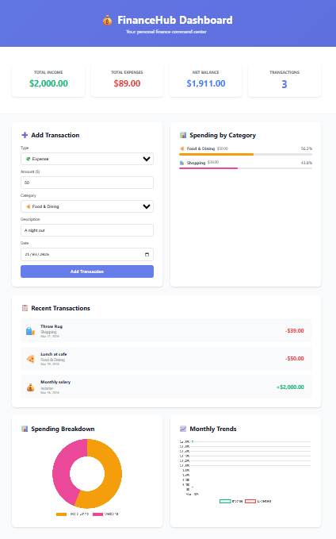
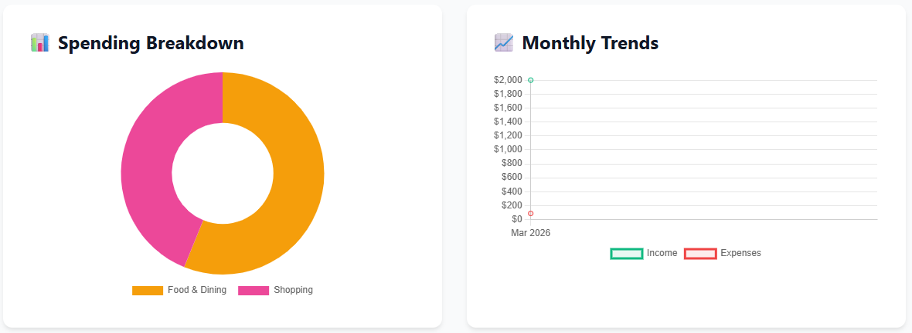

[](https://github.com/Nathan-Forest/FinanceHub/stargazers)
[](https://github.com/Nathan-Forest/FinanceHub/network/members)

# 💰 FinanceHub - Personal Finance Dashboard

A full-stack financial management application built with **C# ASP.NET Core** backend and **vanilla JavaScript** frontend. Track income, expenses, and visualize spending patterns with interactive charts.



## 🎯 Features

### Core Functionality
- ✅ **Transaction Management** - Create, read, update, and delete financial transactions
- ✅ **Category System** - Organize spending across 8 predefined categories
- ✅ **Real-time Analytics** - Summary cards showing income, expenses, and net balance
- ✅ **Visual Reports** - Interactive charts for spending breakdown and monthly trends

### Technical Highlights
- 🏗️ **RESTful API** - Clean, well-structured API endpoints
- 💾 **Entity Framework Core** - ORM with code-first migrations
- 📊 **Chart.js Integration** - Beautiful, responsive data visualizations
- 🎨 **Modern UI** - Gradient design with smooth animations
- 📱 **Responsive Design** - Works seamlessly on desktop and mobile

## 🛠️ Tech Stack

### Backend
- **C# / ASP.NET Core 8.0** - Web API framework
- **Entity Framework Core** - Object-relational mapping
- **SQLite** - Lightweight database for development

### Frontend
- **HTML5 / CSS3** - Modern, semantic markup
- **Vanilla JavaScript** - No framework dependencies
- **Chart.js** - Data visualization library

## 📊 Screenshots

### Dashboard Overview


### Interactive Charts


## 🚀 Getting Started

### Prerequisites
- [.NET 8.0 SDK](https://dotnet.microsoft.com/download)
- A code editor (VS Code recommended)

### Installation

1. **Clone the repository**
```bash
   git clone https://github.com/Nathan-Forest/FinanceHub.git
   cd FinanceHub
```

2. **Restore dependencies**
```bash
   dotnet restore
```

3. **Apply database migrations**
```bash
   dotnet ef database update
```
   This creates the SQLite database with sample data.

4. **Run the application**
```bash
   dotnet run
```

5. **Open your browser**
```
   http://localhost:5000
```

## 📚 API Documentation

### Base URL
```
http://localhost:5000/api
```

### Endpoints

#### Transactions

| Method | Endpoint | Description |
|--------|----------|-------------|
| GET | `/transactions` | Get all transactions |
| GET | `/transactions/{id}` | Get transaction by ID |
| POST | `/transactions` | Create new transaction |
| PUT | `/transactions/{id}` | Update transaction |
| DELETE | `/transactions/{id}` | Delete transaction |
| GET | `/transactions/summary` | Get financial summary |
| GET | `/transactions/by-category` | Get spending by category |
| GET | `/transactions/monthly` | Get monthly breakdown |
| GET | `/transactions/recent?count=10` | Get recent transactions |

#### Categories

| Method | Endpoint | Description |
|--------|----------|-------------|
| GET | `/categories` | Get all categories |
| GET | `/categories/{id}` | Get category by ID |
| POST | `/categories` | Create new category |
| PUT | `/categories/{id}` | Update category |
| DELETE | `/categories/{id}` | Delete category |

### Sample Request

**Create Transaction**
```http
POST /api/transactions
Content-Type: application/json

{
  "amount": 75.50,
  "categoryId": 1,
  "description": "Grocery shopping",
  "date": "2024-03-21",
  "type": "expense"
}
```

**Response**
```json
{
  "id": 3,
  "amount": 75.50,
  "categoryId": 1,
  "description": "Grocery shopping",
  "date": "2024-03-21T00:00:00",
  "type": "expense",
  "category": {
    "id": 1,
    "name": "Food & Dining",
    "icon": "🍕",
    "color": "#f59e0b"
  }
}
```

## 🗂️ Project Structure
```
FinanceHub/
├── Controllers/          # API controllers
│   ├── TransactionsController.cs
│   └── CategoriesController.cs
├── Models/              # Data models
│   ├── Transaction.cs
│   └── Category.cs
├── Data/                # Database context
│   └── AppDbContext.cs
├── Migrations/          # EF Core migrations
├── wwwroot/             # Frontend files
│   ├── index.html
│   ├── css/
│   │   └── style.css
│   └── js/
│       └── app.js
├── Program.cs           # Application entry point
└── README.md
```

## 🎨 Features in Detail

### Summary Cards
Real-time financial overview showing:
- Total income
- Total expenses
- Net balance
- Transaction count

### Category Breakdown
Visual representation of spending across categories with:
- Percentage calculations
- Color-coded bars
- Transaction counts per category

### Monthly Trends
Line chart showing income vs expenses over time to identify:
- Spending patterns
- Income fluctuations
- Financial trends

### Transaction Management
Full CRUD operations with:
- Type selection (Income/Expense)
- Category assignment
- Date tracking
- Descriptive notes

## 🔄 Database Schema

### Transactions Table
| Column | Type | Description |
|--------|------|-------------|
| Id | INTEGER | Primary key |
| Amount | DECIMAL | Transaction amount |
| CategoryId | INTEGER | Foreign key to Categories |
| Description | TEXT | Transaction description |
| Date | DATETIME | Transaction date |
| Type | TEXT | "income" or "expense" |

### Categories Table
| Column | Type | Description |
|--------|------|-------------|
| Id | INTEGER | Primary key |
| Name | TEXT | Category name |
| Icon | TEXT | Emoji icon |
| Color | TEXT | Hex color code |

## 🧪 Development Notes

### SQLite Limitations
The project uses SQLite for simplicity, but note:
- Decimal aggregations are handled in-memory (C#) rather than database-level
- For production/enterprise scale, consider migrating to SQL Server or PostgreSQL

### Migrations
Create new migration:
```bash
dotnet ef migrations add MigrationName
```

Apply migrations:
```bash
dotnet ef database update
```

Remove last migration:
```bash
dotnet ef migrations remove
```

## 🎯 Future Enhancements

- [ ] User authentication and authorization
- [ ] Budget setting and tracking
- [ ] Recurring transactions
- [ ] CSV import/export
- [ ] Multi-currency support
- [ ] Mobile app (Xamarin/MAUI)
- [ ] Email notifications for budget alerts

## 📖 Learning Outcomes

This project demonstrates:
- ✅ Full-stack development with C# and JavaScript
- ✅ RESTful API design principles
- ✅ Entity Framework Core ORM usage
- ✅ Database relationships (one-to-many)
- ✅ Frontend-backend integration
- ✅ Data visualization techniques
- ✅ Responsive web design
- ✅ Git version control

## 👨‍💻 Author

**Nathan Forest**
- GitHub: [@Nathan-Forest](https://github.com/Nathan-Forest)
- LinkedIn: [Nathan Forest](https://linkedin.com/in/nathan-forest-australia)

## 📄 License

This project is open source and available under the [MIT License](LICENSE).

## 🙏 Acknowledgments

- Built as part of my transition from IT Support to Software Development
- Inspired by real-world financial management needs
- Special thanks to the ASP.NET Core and Chart.js communities

---

⭐ If you found this project helpful, please consider giving it a star!
